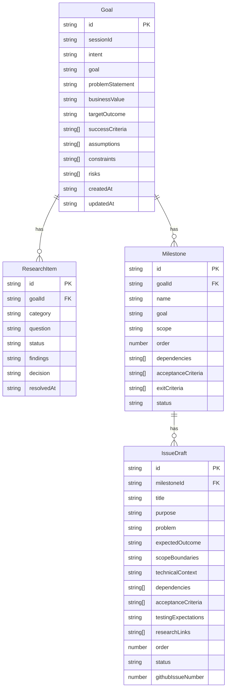

# Data Model: Planning Workflow

> **Status:** ✅ Implemented (Stage 0). See [project-plan-v2.md](./project-plan-v2.md) for current roadmap.
>
> **Quick Reference** — jump directly to an entity: [Goal](#goal) · [ResearchItem](#researchitem) · [Milestone](#milestone) · [IssueDraft](#issuedraft)
>
> **Source files:** [`planning-types.ts`](../../planning-types.ts) · [`planning-store.ts`](../../planning-store.ts)
>
> **Next:** Stage 4 research item [R5](./research-needed.md#r5-persistent-planning-storage) covers migrating from `InMemoryPlanningStore` to persistent Azure Storage.

---

## Overview

The planning data model defines the core entities that drive the next-version planning workflow. Starting from a high-level user intent, the workflow progresses through structured goal definition, research, milestone planning, and issue generation before anything is pushed to GitHub.

```
User intent
    │
    ▼
┌─────────────────────────────────────────────────────────┐
│  PlanningStore  (in-app, pre-GitHub)                     │
│                                                          │
│  Goal ──► ResearchItem(s)                                │
│    │                                                     │
│    └──► Milestone(s) ──► IssueDraft(s)                  │
│                                 │                        │
│                                 └──► pushed to GitHub    │
└─────────────────────────────────────────────────────────┘
```

Once an `IssueDraft` is pushed to GitHub, GitHub becomes the source of truth (Issues, Milestones, Projects, PRs). The planning entities in `PlanningStore` are **pre-GitHub** data only.

---

## Entity Relationship Diagram



---

## Entities

### Goal

A `Goal` is the top-level planning entity. It captures the user's intent and refines it into a structured, actionable objective that drives all subsequent research, milestone, and issue planning.

**Field table**

| Name | Type | Required? | Max length | Description |
|------|------|-----------|------------|-------------|
| `id` | `string` | ✅ | — | UUID generated at runtime. Immutable after creation. |
| `sessionId` | `string` | ✅ | — | The chat session in which this goal was created. |
| `intent` | `string` | ✅ | 2000 chars | The user's raw, unrefined description of what they want to achieve. |
| `goal` | `string` | ✅ | 500 chars | The refined, actionable goal statement derived from the intent. |
| `problemStatement` | `string` | ✅ | 1000 chars | A clear description of the problem this goal addresses. |
| `businessValue` | `string` | ✅ | 500 chars | The business value delivered when this goal is achieved. |
| `targetOutcome` | `string` | ✅ | 500 chars | The desired end state once the goal has been met. |
| `successCriteria` | `string[]` | ✅ | — | Measurable criteria that confirm the goal has been successfully achieved. |
| `assumptions` | `string[]` | ✅ | — | Known assumptions accepted as true without verification. May be empty. |
| `constraints` | `string[]` | ✅ | — | Known limitations or boundaries that constrain the implementation approach. May be empty. |
| `risks` | `string[]` | ✅ | — | Identified risks that could prevent the goal from being achieved. May be empty. |
| `createdAt` | `string` | ✅ | — | ISO 8601 timestamp of creation. Immutable after creation. |
| `updatedAt` | `string` | ✅ | — | ISO 8601 timestamp of the most recent update. |

**Validation rules** (enforced by `PlanningStore.createGoal` and `updateGoal`)

- `id`, `sessionId`, `intent`, `goal`, `problemStatement`, `businessValue`, `targetOutcome`, `createdAt`, `updatedAt` must be non-empty strings (whitespace-only values are rejected).
- `id` and `createdAt` are immutable — `updateGoal` silently ignores any attempt to change them.
- `listGoals(sessionId)` returns goals sorted by `createdAt` ascending.

**Example**

```json
{
  "id": "g-11111111-1111-1111-1111-111111111111",
  "sessionId": "sess-aaaa-bbbb-cccc-dddd",
  "intent": "I want to let the planning agent automatically create GitHub issues from our milestones",
  "goal": "Implement automated issue creation from approved IssueDraft records",
  "problemStatement": "Issue creation is currently manual and error-prone when handling many drafts",
  "businessValue": "Reduces time-to-start for new milestones from hours to minutes",
  "targetOutcome": "Approved IssueDrafts are pushed to GitHub with a single agent command",
  "successCriteria": [
    "All approved drafts in a milestone create GitHub issues within 5 seconds",
    "GitHub issue numbers are stored back on the IssueDraft record"
  ],
  "assumptions": ["GitHub API rate limits will not be hit for typical milestone sizes"],
  "constraints": ["Must use the existing GitHub tools in tools.ts"],
  "risks": ["GitHub API may return errors for duplicate issue titles"],
  "createdAt": "2026-01-15T10:00:00.000Z",
  "updatedAt": "2026-01-15T10:00:00.000Z"
}
```

---

### ResearchItem

A `ResearchItem` captures an open question or investigation topic tied to a `Goal`. Research items are created before implementation starts and are marked resolved once a decision has been recorded.

**Field table**

| Name | Type | Required? | Max length | Description |
|------|------|-----------|------------|-------------|
| `id` | `string` | ✅ | — | UUID generated at runtime. Immutable after creation. |
| `goalId` | `string` | ✅ | — | ID of the parent `Goal`. Immutable after creation. |
| `category` | `string` (enum) | ✅ | — | Research category (see values below). |
| `question` | `string` | ✅ | 500 chars | The specific question to be investigated. |
| `status` | `string` (enum) | ✅ | — | Current status: `open`, `researching`, or `resolved`. |
| `findings` | `string` | ✅ | 2000 chars | Gathered findings. Empty string until researched. |
| `decision` | `string` | ✅ | 1000 chars | Conclusion or decision reached. Empty string until resolved. |
| `resolvedAt` | `string` | ❌ | — | ISO 8601 timestamp. Only set when `status` is `resolved`. |

**Category values**

| Value | Meaning |
|-------|---------|
| `domain` | Business domain knowledge |
| `architecture` | System design and structural decisions |
| `security` | Security requirements and threat model |
| `infrastructure` | Hosting, deployment, and operational concerns |
| `integration` | External system or API interactions |
| `data_model` | Data structure and storage design |
| `operational` | Monitoring, logging, and maintenance |
| `ux` | User experience and interface design |

**Status values**

| Value | Meaning |
|-------|---------|
| `open` | Not yet started |
| `researching` | Actively being investigated |
| `resolved` | Investigation complete; `decision` has been recorded |

**Validation rules** (enforced by `PlanningStore.createResearchItem` and `updateResearchItem`)

- `id`, `goalId`, `question` must be non-empty strings.
- `category` must be one of the 8 valid category values.
- `status` must be one of `open`, `researching`, `resolved`.
- `id` and `goalId` are immutable — `updateResearchItem` silently ignores any attempt to change them.
- `findings` and `decision` are not validated for non-emptiness and typically start as empty strings. `resolvedAt` is optional and starts as `undefined`; it is not validated until set.

**Example**

```json
{
  "id": "ri-22222222-2222-2222-2222-222222222222",
  "goalId": "g-11111111-1111-1111-1111-111111111111",
  "category": "architecture",
  "question": "Should issue creation be synchronous (blocking) or queued?",
  "status": "resolved",
  "findings": "GitHub API supports batch creation but has no native queue. Node.js event loop handles concurrency well for small batches.",
  "decision": "Use synchronous sequential creation with per-issue error handling and retry for network failures.",
  "resolvedAt": "2026-01-16T09:30:00.000Z"
}
```

---

### Milestone

A `Milestone` represents an ordered delivery phase within a `Goal`. Milestones break the goal into discrete, independently trackable chunks of work.

**Field table**

| Name | Type | Required? | Max length | Description |
|------|------|-----------|------------|-------------|
| `id` | `string` | ✅ | — | UUID generated at runtime. Immutable after creation. |
| `goalId` | `string` | ✅ | — | ID of the parent `Goal`. Immutable after creation. |
| `name` | `string` | ✅ | 100 chars | Short, descriptive name for this milestone. |
| `goal` | `string` | ✅ | 500 chars | A concise description of what this milestone aims to deliver. |
| `scope` | `string` | ✅ | 1000 chars | What is included in (and excluded from) this milestone. |
| `order` | `number` | ✅ | — | Position in the delivery sequence. Must be ≥ 1 (1-based). |
| `dependencies` | `string[]` | ✅ | — | IDs of other `Milestone`s that must be complete before this one starts. May be empty. |
| `acceptanceCriteria` | `string[]` | ✅ | — | Conditions that must be true for this milestone to be accepted. |
| `exitCriteria` | `string[]` | ✅ | — | Conditions that must be met before moving to the next milestone. |
| `status` | `string` (enum) | ✅ | — | Current status: `draft`, `ready`, `in-progress`, or `complete`. |

**Status values**

| Value | Meaning |
|-------|---------|
| `draft` | Being defined; not yet ready for execution |
| `ready` | Fully defined and ready to start |
| `in-progress` | Currently being executed |
| `complete` | All exit criteria have been met |

**Validation rules** (enforced by `PlanningStore.createMilestone` and `updateMilestone`)

- `id`, `goalId`, `name`, `goal`, `scope` must be non-empty strings.
- `order` must be a number ≥ 1.
- `status` must be one of `draft`, `ready`, `in-progress`, `complete`.
- `id` and `goalId` are immutable — `updateMilestone` silently ignores any attempt to change them.
- `listMilestones(goalId)` returns milestones sorted by `order` ascending.

**Example**

```json
{
  "id": "m-33333333-3333-3333-3333-333333333333",
  "goalId": "g-11111111-1111-1111-1111-111111111111",
  "name": "Stage 1: Core issue creation",
  "goal": "Implement the core API and agent tool for pushing a single IssueDraft to GitHub",
  "scope": "In scope: POST /api/issues endpoint, createGitHubIssue tool. Out of scope: batch creation, error retry.",
  "order": 1,
  "dependencies": [],
  "acceptanceCriteria": [
    "An approved IssueDraft can be pushed to GitHub via agent command",
    "The GitHub issue number is stored on the IssueDraft record"
  ],
  "exitCriteria": [
    "All acceptance criteria pass",
    "Integration test covers the happy path"
  ],
  "status": "ready"
}
```

---

### IssueDraft

An `IssueDraft` is an implementation-ready GitHub issue definition tied to a `Milestone`. Issue drafts are generated during planning and eventually pushed to GitHub as real issues.

**Field table**

| Name | Type | Required? | Max length | Description |
|------|------|-----------|------------|-------------|
| `id` | `string` | ✅ | — | UUID generated at runtime. Immutable after creation. |
| `milestoneId` | `string` | ✅ | — | ID of the parent `Milestone`. Immutable after creation. |
| `title` | `string` | ✅ | 256 chars | The GitHub issue title. |
| `purpose` | `string` | ✅ | 500 chars | A brief description of what this issue is for and why it exists. |
| `problem` | `string` | ✅ | 1000 chars | The specific problem or gap this issue addresses. |
| `expectedOutcome` | `string` | ✅ | 500 chars | The desired end state once this issue is implemented. |
| `scopeBoundaries` | `string` | ✅ | 1000 chars | What is in scope and explicitly out of scope for this issue. |
| `technicalContext` | `string` | ✅ | 2000 chars | Background information, patterns, and constraints relevant to implementation. |
| `dependencies` | `string[]` | ✅ | — | IDs of other `IssueDraft`s that must be completed before this one. May be empty. |
| `acceptanceCriteria` | `string[]` | ✅ | — | Conditions that must be true for this issue to be considered complete. |
| `testingExpectations` | `string` | ✅ | 1000 chars | Description of required tests and testing strategy. |
| `researchLinks` | `string[]` | ✅ | — | IDs of resolved `ResearchItem`s whose findings are relevant. May be empty. |
| `order` | `number` | ✅ | — | Position within the milestone. Must be ≥ 1 (1-based). |
| `status` | `string` (enum) | ✅ | — | Current status: `draft`, `ready`, or `created`. |
| `githubIssueNumber` | `number` | ❌ | — | The GitHub issue number assigned after pushing to GitHub. Only set when `status` is `created`. |

**Status values**

| Value | Meaning |
|-------|---------|
| `draft` | Being defined; not yet ready for creation |
| `ready` | Fully defined and ready to push to GitHub |
| `created` | Successfully created as a GitHub issue; `githubIssueNumber` is set |

**Validation rules** (enforced by `PlanningStore.createIssueDraft` and `updateIssueDraft`)

- `id`, `milestoneId`, `title`, `purpose`, `problem`, `expectedOutcome` must be non-empty strings.
- `order` must be a number ≥ 1.
- `status` must be one of `draft`, `ready`, `created`.
- `id` and `milestoneId` are immutable — `updateIssueDraft` silently ignores any attempt to change them.
- `scopeBoundaries`, `technicalContext`, `testingExpectations` are required fields but not validated for non-emptiness.
- `listIssueDrafts(milestoneId)` returns drafts sorted by `order` ascending.

**Example**

```json
{
  "id": "id-44444444-4444-4444-4444-444444444444",
  "milestoneId": "m-33333333-3333-3333-3333-333333333333",
  "title": "Add createGitHubIssue tool to tools.ts",
  "purpose": "Expose a GitHub issue creation tool so the Copilot agent can push IssueDrafts to GitHub.",
  "problem": "There is currently no tool for the agent to create GitHub issues programmatically.",
  "expectedOutcome": "Agent can call createGitHubIssue(title, body, labels) and the issue appears in the GitHub repo.",
  "scopeBoundaries": "In scope: single issue creation. Out of scope: batch creation, milestone association.",
  "technicalContext": "Follow the pattern of existing tools in tools.ts. Use the GitHub REST API POST /repos/{owner}/{repo}/issues endpoint.",
  "dependencies": [],
  "acceptanceCriteria": [
    "Tool is registered in createGitHubTools(token)",
    "Calling the tool with valid args creates a real GitHub issue",
    "Returns the created issue number"
  ],
  "testingExpectations": "Add integration test using a real token. Assert the returned issue number is a positive integer.",
  "researchLinks": ["ri-22222222-2222-2222-2222-222222222222"],
  "order": 1,
  "status": "ready"
}
```

---

## Store Interface Summary

`PlanningStore` exposes a consistent CRUD interface for all four entity types. All methods are `async` to support a future Azure Storage backend.

| Method | Returns | Notes |
|--------|---------|-------|
| `createGoal(goal)` | `Goal` | Validates and persists. Throws on invalid input. |
| `getGoal(goalId)` | `Goal \| null` | Returns `null` if not found. |
| `updateGoal(goalId, updates)` | `Goal \| null` | `id` and `createdAt` are immutable. Returns `null` if not found. |
| `deleteGoal(goalId)` | `boolean` | `true` if deleted, `false` if not found. |
| `listGoals(sessionId)` | `Goal[]` | Ordered by `createdAt` ascending. |
| `createResearchItem(item)` | `ResearchItem` | Validates and persists. Throws on invalid input. |
| `getResearchItem(itemId)` | `ResearchItem \| null` | Returns `null` if not found. |
| `updateResearchItem(itemId, updates)` | `ResearchItem \| null` | `id` and `goalId` are immutable. Returns `null` if not found. |
| `deleteResearchItem(itemId)` | `boolean` | `true` if deleted, `false` if not found. |
| `listResearchItems(goalId)` | `ResearchItem[]` | No guaranteed sort order. |
| `createMilestone(milestone)` | `Milestone` | Validates and persists. Throws on invalid input. |
| `getMilestone(milestoneId)` | `Milestone \| null` | Returns `null` if not found. |
| `updateMilestone(milestoneId, updates)` | `Milestone \| null` | `id` and `goalId` are immutable. Returns `null` if not found. |
| `deleteMilestone(milestoneId)` | `boolean` | `true` if deleted, `false` if not found. |
| `listMilestones(goalId)` | `Milestone[]` | Ordered by `order` ascending. |
| `createIssueDraft(draft)` | `IssueDraft` | Validates and persists. Throws on invalid input. |
| `getIssueDraft(draftId)` | `IssueDraft \| null` | Returns `null` if not found. |
| `updateIssueDraft(draftId, updates)` | `IssueDraft \| null` | `id` and `milestoneId` are immutable. Returns `null` if not found. |
| `deleteIssueDraft(draftId)` | `boolean` | `true` if deleted, `false` if not found. |
| `listIssueDrafts(milestoneId)` | `IssueDraft[]` | Ordered by `order` ascending. |

The `InMemoryPlanningStore` class implements `PlanningStore` using `Map<string, Entity>` backing stores and `structuredClone` to prevent external mutation of stored objects.

---

## Design Decisions

### ISO 8601 strings for timestamps

Timestamps (`createdAt`, `updatedAt`, `resolvedAt`) are stored as ISO 8601 strings rather than `Date` objects for three reasons:

1. **Serialization safety** — `Date` objects do not round-trip cleanly through `JSON.stringify`/`JSON.parse`, which would be required for Azure Table Storage and SSE transmission.
2. **Schema compatibility** — Azure Table Storage stores datetimes as strings.
3. **Simplicity** — Comparison is straightforward (`new Date(a.createdAt).getTime()`), and string storage avoids timezone conversion bugs at the serialization boundary.

### String IDs (UUIDs)

All entity IDs are `string` type, expected to be UUIDs generated at the call site. This decision:

- Avoids auto-increment collisions in a distributed or multi-replica deployment.
- Allows IDs to be generated on the frontend or AI agent before the entity is persisted (useful for pre-linking dependencies).
- Is consistent with the existing `SessionMetadata.id` pattern in `storage.ts`.

### In-memory first (`InMemoryPlanningStore`)

The first implementation is in-memory rather than going straight to Azure Storage because:

- It enables fast unit testing with no external dependencies (see `npm run test:planning`).
- It follows the exact same pattern as `InMemorySessionStore` in `storage.ts`.
- A future `AzurePlanningStore` can replace it transparently — the `PlanningStore` interface is the contract.

### Separate `PlanningStore` from `SessionStore`

Planning data (goals, research, milestones, issue drafts) is separate from chat session data:

- **Different lifecycle** — planning entities persist long-term; chat sessions are ephemeral conversation contexts.
- **Different query patterns** — planning data is queried by `goalId`/`milestoneId`; sessions are queried by user token.
- **Future storage flexibility** — planning data may eventually move to a relational or document store while sessions stay in Azure Table Storage.

### Immutable identity fields

`id` and parent-link fields (`goalId` on ResearchItem and Milestone, `milestoneId` on IssueDraft) cannot be changed via `update*` methods. This prevents accidental re-parenting of entities, which would corrupt the hierarchy. For `Goal`, only `id` is immutable — `sessionId` is intentionally mutable and can be changed via `updateGoal` when re-associating a goal with a different session.

### Literal-union status fields

Status fields (`ResearchItem.status`, `Milestone.status`, `IssueDraft.status`) use TypeScript literal unions rather than `enum`. This keeps the values plain strings in JSON, avoids TypeScript `enum` pitfalls (reverse-mapping, numeric enums), and is consistent with the rest of the codebase.

---

## Source Files

| File | Purpose |
|------|---------|
| [`planning-types.ts`](../../planning-types.ts) | TypeScript interface definitions for `Goal`, `ResearchItem`, `Milestone`, and `IssueDraft` |
| [`planning-store.ts`](../../planning-store.ts) | `PlanningStore` interface, validation helpers, and `InMemoryPlanningStore` implementation |
| [`planning-store.test.ts`](../../planning-store.test.ts) | Unit tests for `InMemoryPlanningStore` — run with `npm run test:planning` |

---

## Related Documentation

- [Product Goal](goal.md) — Product vision and success criteria
- [Project Plan](project-plan-v2.md) — Updated roadmap (Stages 0–3 complete, Stages 4–5 planned)
- [Research Needed](research-needed.md) — Required research before continuing (includes R5: persistent storage)
- [Issue Breakdown](issue-breakdown.md) — Implementation issues by stage
- [Architecture](../architecture.md) — System architecture and storage patterns
- [Backend](../backend.md) — Express server and storage integration
